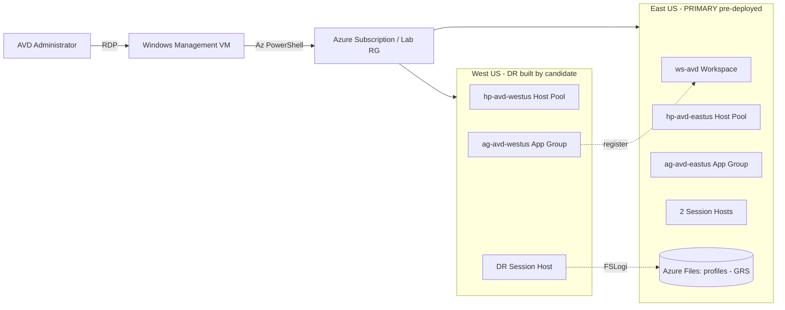

# **Azure Virtual Desktop — Disaster Recovery-Assessment — 01**

Welcome to your Azure Virtual Desktop (AVD) Disaster Recovery hands-on skills assessment. This environment gives you a live Windows management VM and a dedicated Azure subscription and resource group in which a **primary AVD environment is already running in East US**. Read this page, then move to **Exercise 1** to begin.

### **Overall Estimated timing: 120 Minutes**

## **Overview**

In this assessment you act as an **AVD administrator** responsible for business continuity. A production AVD environment is **pre-deployed for you in East US** — workspace, host pool, application group, two session hosts, and an Azure Files share for FSLogix profiles. From a Windows management VM you connect to the lab's Azure subscription and **implement and test a Disaster Recovery (DR) solution in West US**: you stand up a secondary host pool, register it with the existing workspace, wire up FSLogix on geo-redundant storage, then simulate a regional outage and prove users can still connect. You are graded on the **state of the Azure resources** in the lab resource group.

## **Objectives**

By the end of this assessment you will have:

1. **Deployed a secondary AVD host pool** (`hp-avd-westus`) with at least one session host in West US.
2. **Registered the DR host pool with the existing workspace** (`ws-avd`) through a West US application group.
3. **Configured FSLogix profiles on the provided Azure Files share** and verified the storage account is geo-redundant.
4. **Simulated a regional outage** by draining/stopping the primary session hosts and verified the DR host pool is ready to accept connections.

## **Pre-requisites**

Working knowledge of Azure Virtual Desktop: host pools, session hosts, workspaces and application groups; FSLogix profile containers and Azure Files; Azure Storage replication (LRS/GRS/GZRS/RAGRS) and regional resiliency; and the `Az.DesktopVirtualization` PowerShell module (`Get-/New-/Update-AzWvd*`) together with `Az.Storage` and `Az.Compute`.

## **Architecture**

A single Windows management VM is your control point. You connect to it over RDP, sign in to the lab's Azure subscription with Az PowerShell, and operate the East US primary AVD environment and the West US DR environment.

## **Getting Started with the lab**

Your virtual machine and this **Guide** are available within your web browser. Use the **Split Window** button at the top-right to open the guide beside your desktop session.

## **Accessing Your Lab Environment**

1. Connect to the Lab VM over RDP using the details on the **Environment** tab.

    - **RDP command:** see the **LABVM RDP Command** output on the **Environment** tab
    - **Username:** see the **LABVM Admin Username** output on the **Environment** tab
    - **Password:** see the **LABVM Admin Password** output on the **Environment** tab

1. Sign in to the Azure portal (and `Connect-AzAccount` on the VM) with the credentials below:

    - **Email/Username:** <inject key="AzureAdUserEmail"></inject>

    - **Password:** <inject key="AzureAdUserPassword"></inject>

1. Your environment id for this run is **<inject key="DeploymentID" enableCopy="false"/>** — quote it if you contact support.

### **Environment Details**

The following resources are **pre-deployed** in the lab resource group when your environment starts. Do **not** recreate them — build your DR resources alongside them in the **same resource group**.

| Resource | Name | Region | Notes |
|---|---|---|---|
| Lab resource group | (shown by `Get-AzResourceGroup`) | — | Target every resource here |
| Primary virtual network | `vnet-avd-eastus` | East US | `10.10.0.0/16`, subnet `hosts` |
| Secondary virtual network (for DR) | `vnet-avd-westus` | West US | `10.20.0.0/16`, subnet `hosts` — pre-provisioned, empty |
| AVD workspace | `ws-avd` | East US | Already references `ag-avd-eastus` |
| Primary host pool | `hp-avd-eastus` | East US | Pooled / BreadthFirst, **2 session hosts** |
| Primary application group | `ag-avd-eastus` | East US | Desktop, registered to `ws-avd` |
| Storage account | `stavd<unique>` | East US | **Standard_GRS** (geo-redundant) |
| FSLogix profile share | `\\stavd<unique>.file.core.windows.net\profiles` | East US | Azure Files SMB share |

The secondary `vnet-avd-westus` network is provided for your DR host pool's session hosts. Everything in West US (host pool, application group, session host) is yours to build.

## **Track Your Progress**

Use the **Validate** button on each task to check your work. The **Progress** tab shows your validation score; it reaches 100% when all task validations pass.

## **Lab Duration Extension**

You have **120 minutes** for this assessment. If you need more time, click the **Hourglass** icon in the top-right of the lab environment (it appears when 10 minutes remain) and click **OK**.

## **Support Contact**

The CloudLabs support team is available 24/7 via email and live chat.

- Email Support: cloudlabs-support@spektrasystems.com
- Live Chat Support: https://cloudlabs.ai/labs-support

Click **Next** to begin Exercise 1.

## **Happy Assessing !!**
